# Digital Library Management System

A full-stack library management application developed for the **Oasis Infobyte Java Development Internship**.

The application provides secure member and administrator workflows for managing books, loans, returns, overdue fines, advance reservations, accounts, and contact queries.

## Internship Information

- **Intern:** Youssef Eslam
- **Track:** Java Development
- **Task:** Task 5 — Digital Library Management System
- **Organization:** Oasis Infobyte
- **Repository:** [OIBSIP](https://github.com/Youssefeslamm/OIBSIP)

## Features

### Member Features

- Register using an email address and password
- Securely sign in and sign out
- Browse the active book catalogue
- Search books by title or author
- Filter books by category
- Issue available books
- Return borrowed books
- View current and previous loans
- Track loan due dates
- View overdue fines and payment status
- Reserve unavailable books
- Track reservation queue status
- Cancel waiting or available reservations
- Submit contact queries
- Review previously submitted messages

### Administrator Features

- Role-protected administrator dashboard
- Add new books
- Edit book details and quantities
- Archive and restore books
- Permanently delete unused books
- View active and overdue loans
- View registered member accounts
- Enable and disable member accounts
- View unpaid fines
- Mark fines as paid
- View open user queries
- Mark queries as resolved

### Business Rules

- Available quantity cannot become negative.
- Available quantity cannot exceed total quantity.
- A user cannot issue the same book twice simultaneously.
- A user can reserve a book only when all copies are unavailable.
- Duplicate active reservations are rejected.
- Returned copies are offered to waiting users in queue order.
- A copy reserved for one member cannot be issued by another member.
- Overdue fines are calculated at ₹5 per started overdue day.
- Completed loans cannot be returned twice.
- Paid fines cannot be marked as paid twice.
- Administrators cannot disable their own accounts.
- Books with loan or reservation history cannot be permanently deleted and should be archived instead.

## Technology Stack

### Backend

- Java 25
- Spring Boot 4.1
- Spring MVC
- Spring Security
- Spring Data JPA
- Hibernate
- Jakarta Validation

### Frontend

- Thymeleaf
- HTML5
- CSS3
- Responsive layouts

### Database and Tools

- MySQL
- Flyway
- Maven
- JUnit 5
- Mockito
- Postman
- IntelliJ IDEA
- Git and GitHub

## Architecture

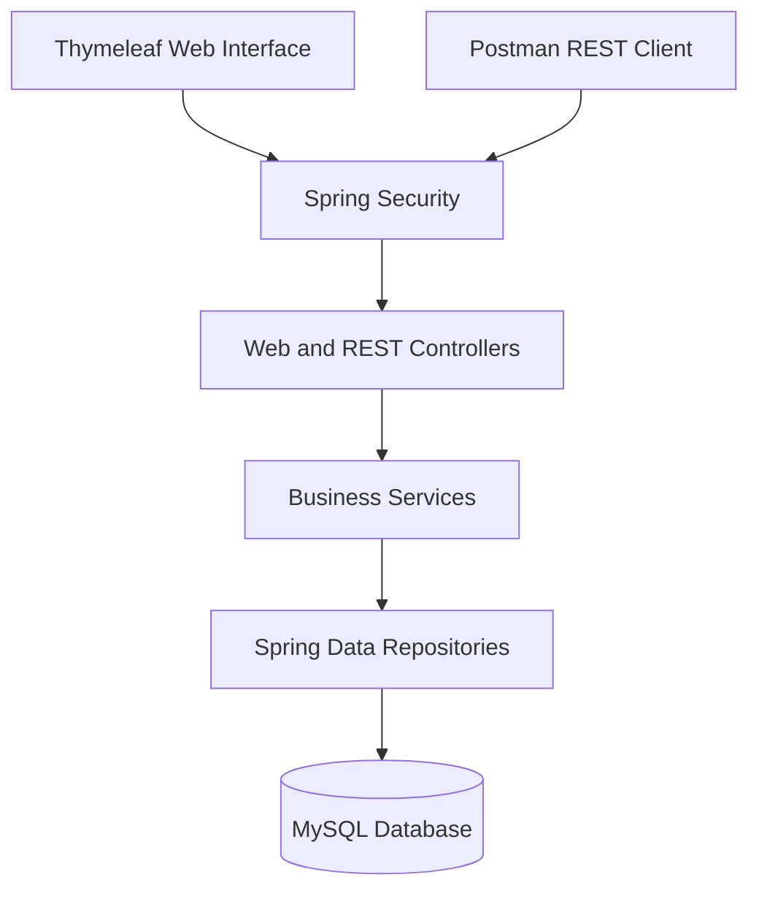

The application follows a layered architecture:

```text
Controller → Service → Repository → Database
```

- **Controllers** handle browser and REST requests.
- **Services** enforce application rules and manage transactions.
- **Repositories** provide database access through Spring Data JPA.
- **Entities** represent persistent domain objects.
- **DTOs** define validated request and response models.
- **Flyway** manages database creation, seed data, and schema versioning.

## Database Model

| Table | Purpose |
|---|---|
| `users` | Registered member and administrator accounts |
| `roles` | User and administrator roles |
| `user_roles` | Account-to-role relationships |
| `categories` | Book categories |
| `books` | Catalogue information and inventory |
| `loans` | Book issues, returns, and due dates |
| `fines` | Overdue charges and payment status |
| `reservations` | Advance-booking queue |
| `contact_messages` | Member contact queries |
| `flyway_schema_history` | Applied database migrations |

## Project Structure

```text
src/main/java/com/youssefeslam/library/
├── config/
├── controller/
├── dto/
├── entity/
├── exception/
├── repository/
├── security/
├── service/
└── DigitalLibraryManagementSystemApplication.java

src/main/resources/
├── db/
│   └── migration/
├── static/
│   └── css/
├── templates/
│   ├── admin/
│   ├── auth/
│   ├── books/
│   ├── fines/
│   ├── loans/
│   ├── messages/
│   └── reservations/
└── application.properties
```

## Screenshots

### Landing Page

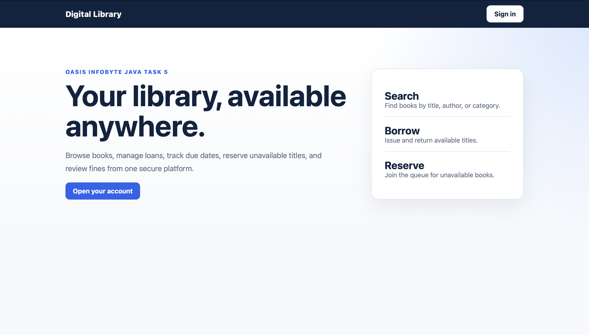

### Login Page

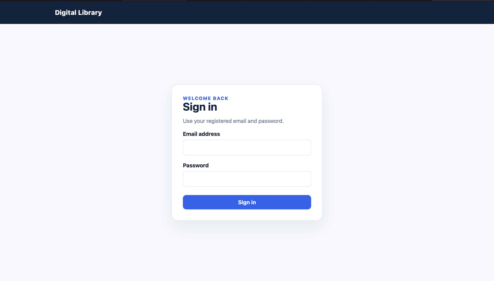

### User Dashboard

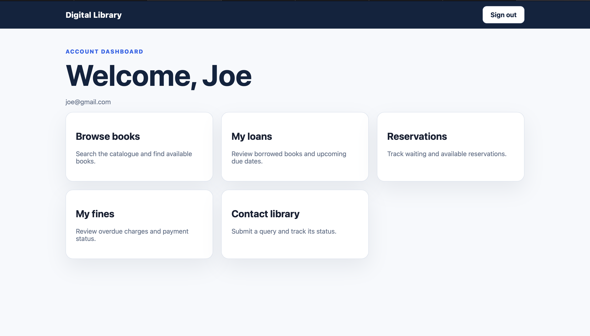

### Book Catalogue

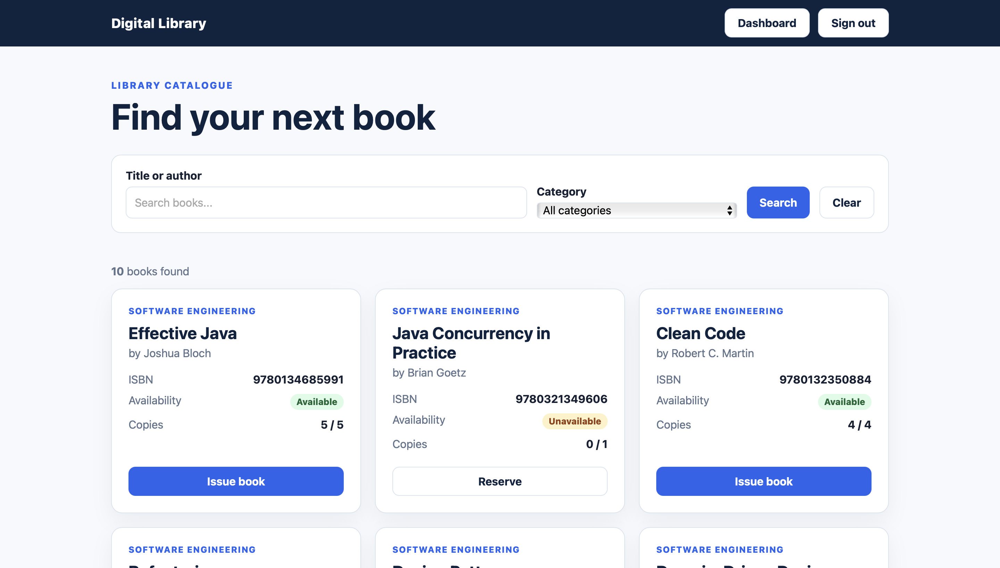

### My Loans

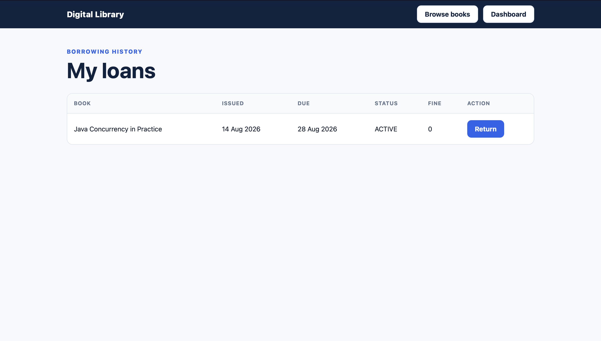

### My Reservations

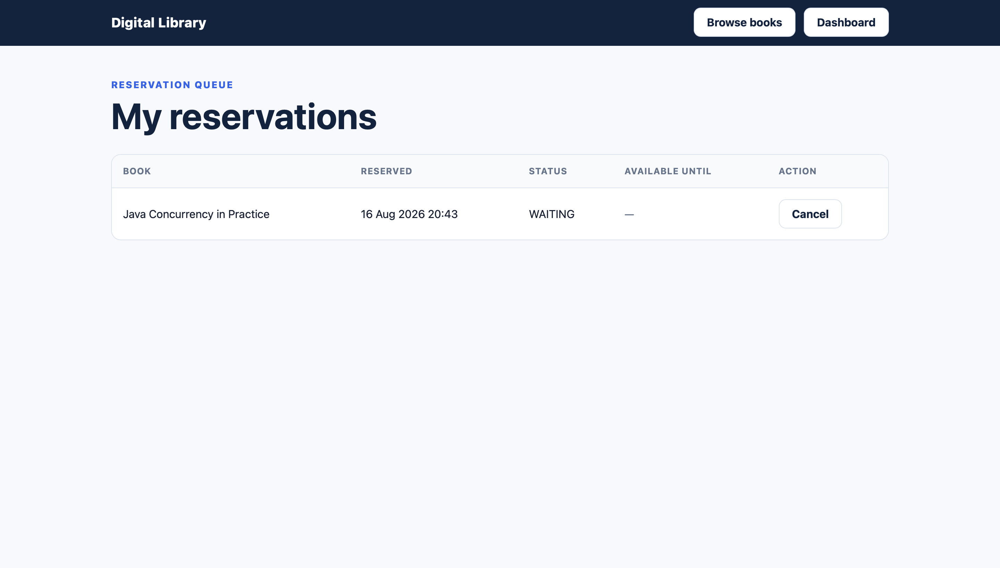

### My Fines

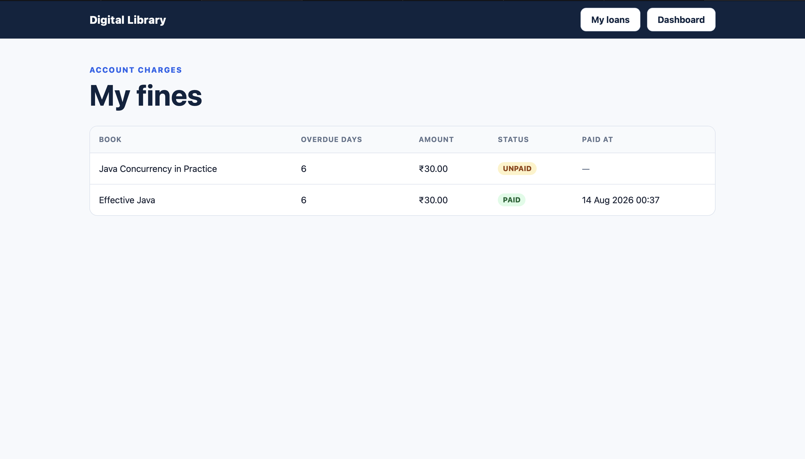

### Contact Queries

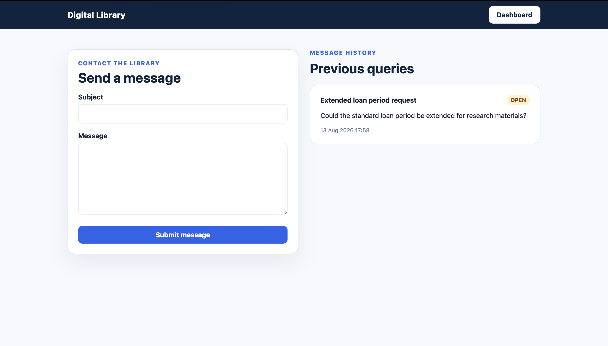

### Administrator Dashboard

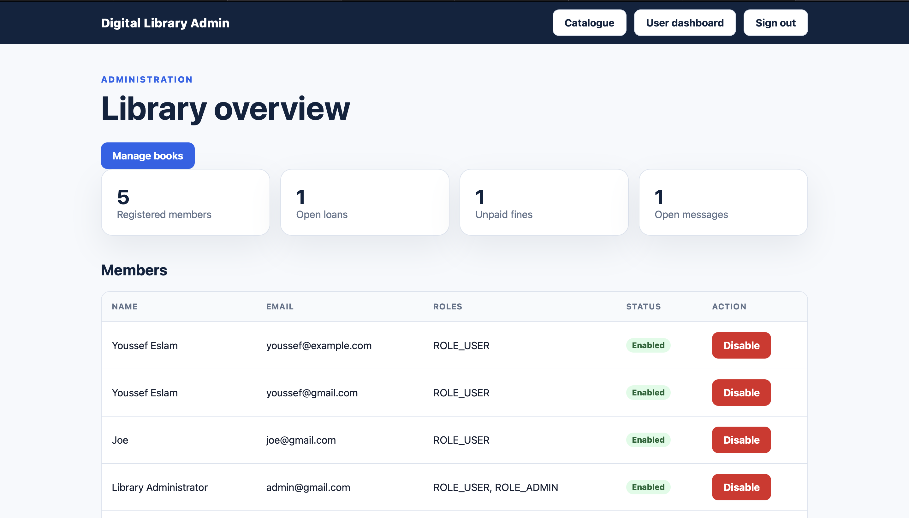

### Administrator Book Management

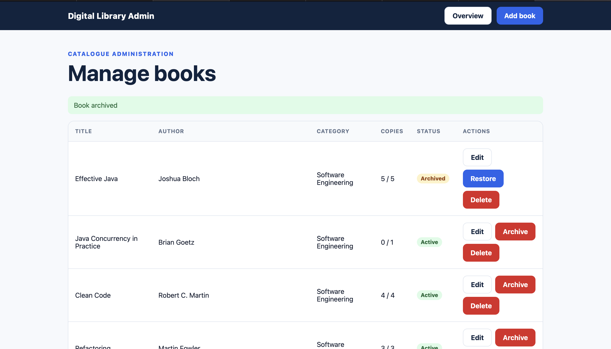

## Requirements

Install the following before running the project:

- Java 25, or another version supported by the configured Spring Boot release
- MySQL 8 or newer
- Git

The Maven Wrapper is included, so a separate Maven installation is not required.

## Local Setup

### 1. Clone the repository

```bash
git clone https://github.com/Youssefeslamm/OIBSIP.git
cd OIBSIP/Java-Task5-DigitalLibraryManagementSystem
```

### 2. Create the MySQL database

Connect to MySQL using an administrative account and run:

```sql
CREATE DATABASE IF NOT EXISTS digital_library
    CHARACTER SET utf8mb4
    COLLATE utf8mb4_0900_ai_ci;

CREATE USER IF NOT EXISTS 'library_app'@'localhost'
    IDENTIFIED BY 'YOUR_PRIVATE_PASSWORD';

CREATE USER IF NOT EXISTS 'library_app'@'127.0.0.1'
    IDENTIFIED BY 'YOUR_PRIVATE_PASSWORD';

GRANT ALL PRIVILEGES
    ON digital_library.*
    TO 'library_app'@'localhost';

GRANT ALL PRIVILEGES
    ON digital_library.*
    TO 'library_app'@'127.0.0.1';

FLUSH PRIVILEGES;
```

Never commit the database password.

### 3. Configure the database password

The application reads the database password from an environment variable:

```properties
spring.datasource.password=${DB_PASSWORD}
```

In IntelliJ IDEA, add this environment variable to the Spring Boot run configuration:

```text
DB_PASSWORD=your_private_database_password
```

Alternatively, run from Terminal without displaying the password:

```bash
read -s "DB_PASSWORD?Database password: "
echo
export DB_PASSWORD
./mvnw spring-boot:run
unset DB_PASSWORD
```

### 4. Open the application

Visit:

```text
http://localhost:8080
```

Flyway automatically creates and seeds the required database structure when the application starts.

## Creating an Administrator

New registrations receive `ROLE_USER` by default.

Register the intended administrator through the application, then grant the administrator role using MySQL:

```sql
USE digital_library;

INSERT IGNORE INTO user_roles (user_id, role_id)
SELECT users.id, roles.id
FROM users
JOIN roles
    ON roles.name = 'ROLE_ADMIN'
WHERE users.email = 'your-admin-email@example.com';
```

Sign out and sign back in after granting the role.

Do not commit administrator credentials.

## Web Routes

| Route | Description | Access |
|---|---|---|
| `/` | Landing page | Public |
| `/login` | Login page | Public |
| `/dashboard` | Member dashboard | Authenticated |
| `/books` | Searchable catalogue | Authenticated |
| `/my-loans` | Member loan history | Authenticated |
| `/my-reservations` | Member reservations | Authenticated |
| `/my-fines` | Member fine history | Authenticated |
| `/contact` | Contact form and message history | Authenticated |
| `/admin` | Administrator overview | Admin |
| `/admin/books` | Administrator book management | Admin |

## REST API

The REST API currently supports HTTP Basic authentication.

### Authentication

| Method | Endpoint | Access |
|---|---|---|
| POST | `/api/auth/register` | Public |
| GET | `/api/auth/me` | Authenticated |

### Categories

| Method | Endpoint | Access |
|---|---|---|
| GET | `/api/categories` | Public |
| GET | `/api/categories/{id}` | Public |
| POST | `/api/categories` | Admin |

### Books

| Method | Endpoint | Access |
|---|---|---|
| GET | `/api/books` | Public |
| GET | `/api/books/{id}` | Public |
| GET | `/api/books/search?query=` | Public |
| GET | `/api/books/category/{categoryId}` | Public |
| POST | `/api/books` | Admin |
| PUT | `/api/books/{id}` | Admin |
| PATCH | `/api/books/{id}/archive` | Admin |
| PATCH | `/api/books/{id}/restore` | Admin |
| DELETE | `/api/books/{id}` | Admin |

### Loans

| Method | Endpoint | Access |
|---|---|---|
| POST | `/api/loans` | User |
| GET | `/api/loans/me` | User |
| POST | `/api/loans/{loanId}/return` | User |
| GET | `/api/admin/loans` | Admin |

### Fines

| Method | Endpoint | Access |
|---|---|---|
| GET | `/api/fines/me` | User |
| GET | `/api/admin/fines?status=UNPAID` | Admin |
| PATCH | `/api/admin/fines/{fineId}/pay` | Admin |

### Reservations

| Method | Endpoint | Access |
|---|---|---|
| POST | `/api/reservations` | User |
| GET | `/api/reservations/me` | User |
| PATCH | `/api/reservations/{reservationId}/cancel` | User |

### Contact Queries

| Method | Endpoint | Access |
|---|---|---|
| POST | `/api/messages` | User |
| GET | `/api/messages/me` | User |
| GET | `/api/admin/messages?status=OPEN` | Admin |
| PATCH | `/api/admin/messages/{messageId}/resolve` | Admin |

### Member Administration

| Method | Endpoint | Access |
|---|---|---|
| GET | `/api/admin/users` | Admin |
| GET | `/api/admin/users/{userId}` | Admin |
| PATCH | `/api/admin/users/{userId}/disable` | Admin |
| PATCH | `/api/admin/users/{userId}/enable` | Admin |

## Postman

Import the provided collection and environment files into Postman:

```text
OIBSIP_Digital_Library.postman_collection.json
OIBSIP_Local.postman_environment.json
```

Set the following environment values locally:

```text
baseUrl = http://localhost:8080
basicUsername = your_registered_email
basicPassword = your_private_password
```

Never commit populated password or token values.

## Testing

Run the complete test suite:

```bash
read -s "DB_PASSWORD?Database password: "
echo
export DB_PASSWORD
./mvnw test
unset DB_PASSWORD
```

Run only the domain tests:

```bash
./mvnw -Dtest=DomainModelTest test
```

Run only the book-service tests:

```bash
./mvnw -Dtest=BookServiceTest test
```

Create a production package:

```bash
read -s "DB_PASSWORD?Database password: "
echo
export DB_PASSWORD
./mvnw clean package
unset DB_PASSWORD
```

## Security

- Passwords are hashed using BCrypt.
- Plain-text application and database credentials are not committed.
- Administrator and member permissions are separated.
- Browser forms use CSRF protection.
- REST endpoints use HTTP Basic authentication.
- Disabled users cannot authenticate.
- Database mutations execute inside transactions.
- Inventory and reservation operations use pessimistic locking.
- JPA and parameterized queries reduce SQL-injection risk.
- Sensitive environment variables remain outside source control.

## Future Improvements

- Email notifications for upcoming due dates
- Reservation-availability notifications
- Password-reset workflow
- Online fine payments
- Book-cover image uploads
- Audit logging
- Docker-based local setup
- Cloud deployment
- JWT authentication for external API clients

## Author

**Youssef Eslam**

Java Development Intern — Oasis Infobyte# OIBSIP
